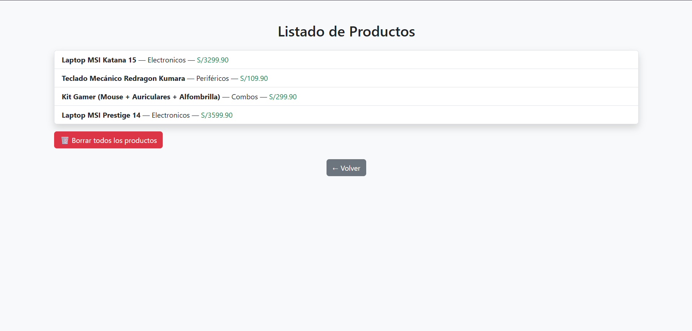

# 🛍️ Sistema de Registro de Productos - Flask MVC

Aplicación web simple desarrollada en Python con Flask, aplicando la arquitectura Modelo-Vista-Controlador (MVC).

## 🚀 Características

- Registrar productos con nombre, categoría y precio.
- Listar productos registrados.
- Interfaz básica pero atractiva con Bootstrap 5.
- Código organizado por capas (MVC).
- Datos almacenados temporalmente en memoria.

## 📂 Estructura del Proyecto

mvc-flask-app/
│
├── app.py # Controlador y rutas
├── modelo.py # Lógica y almacenamiento (modelo)
├── templates/ # Vistas (HTML con Bootstrap)
│ ├── index.html
│ └── lista.html
├── README.md # Descripción del proyecto

## 📸 Capturas

| Registro | Listado |
|----------|---------|
|  |  |

## 📦 Requisitos

- Python  
- Flask

▶️ Ejecución

```bash
pip install flask
python app.py
```
Abre tu navegador en http://localhost:5000

🧠 Aprendizaje
Este proyecto ayuda a entender:

Separación de responsabilidades usando MVC.

Uso básico de Flask y Jinja2.

Cómo subir y documentar un proyecto en GitHub.

✍️ Autor
Andersson – @thelimmp